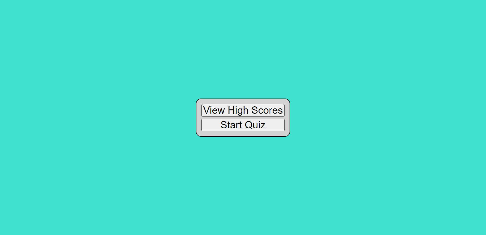
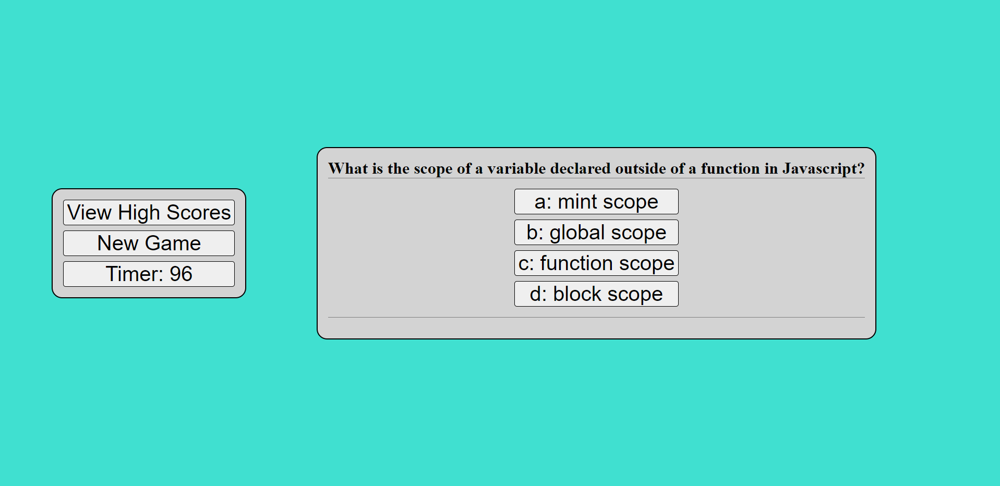
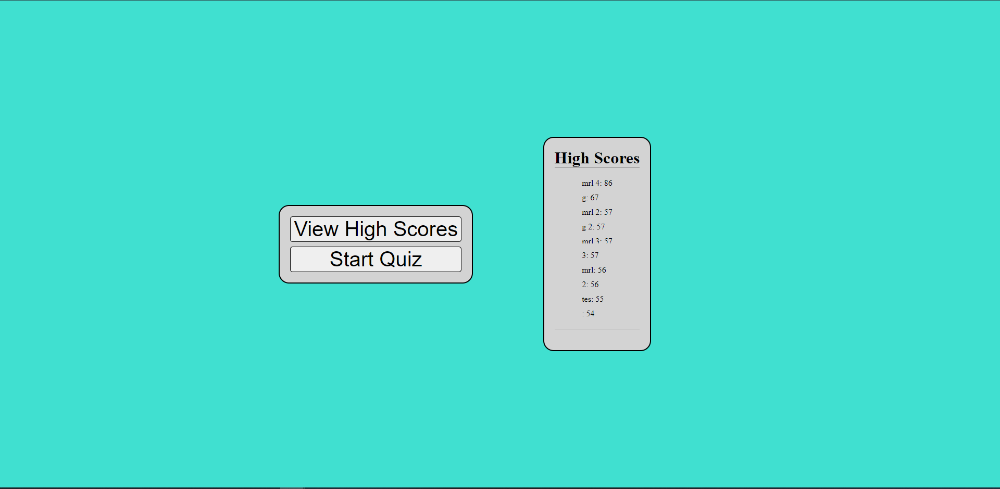

# code-quiz
This website starts a quiz when the user clicks "start", and then starts a 100 second countdown.  If the user answers a question incorrectly, the timer is reduced by 10 seconds.  The quiz ends when the user answers all questions or the timer reaches zero.  

When the quiz ends the score is saved to localStorage and the user is presented with their score and an option to enter their initials to refrence their score.  

When the user clicks "View High Scores" they are presented with the scores saved in localStorage and their associated initials in order from highest score to lowest.

## Deployed Link
https://mrlowther.github.io/code-quiz/

## Images

### Home Screen

### Quiz Page

### High Scores

